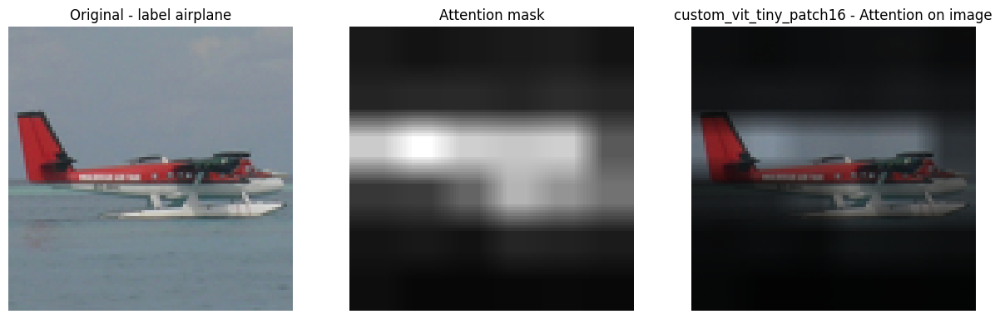
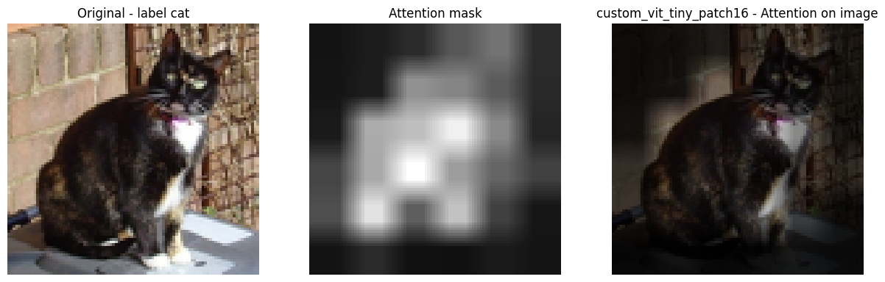
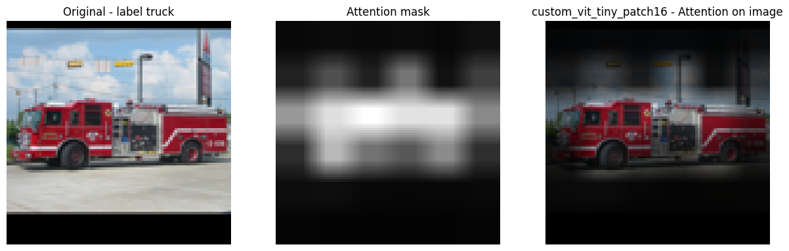

## **lightning-ssl**
lightning-ssl is a computer vision library for exploring self-supervised techniques with almost no-code.

### **Features**

lightning-ssl offers features like:
* access to teacher-student self-supervised building blocks at ease 
* support for multi-gpu training thanks to PyTorch Lightning
* support timm's backbone

### **Supported Models**

lightning-ssl currently supports the following teacher-student based models:

* BYOL (2020) ([`arXiv`](https://arxiv.org/pdf/2006.07733.pdf), [`repository`](https://github.com/deepmind/deepmind-research/tree/master/byol))
<p align="center">
    
</p>

* DINO (2021) ([`arXiv`](https://arxiv.org/pdf/2104.14294.pdf), [`repository`](https://github.com/facebookresearch/dino))
<p align="center">
    
</p>

### **How to use it**
lightning-ssl gives you easy access to already implemented building blocks which can be painful to develop from scratch. 

Experiment with different techniques and models and don't care about implementing views generation, specific loss functions, etc. 

You can always use the PyTorch terrific modularity to define your custom dataset, loss, etc. and use them with lightning-ssl.

```python
# DINO example

import pytorch_lightning as pl

# define train and val augmentations (see docs for more details)
from lightning_ssl.transform import Transform

train_transform = Transform(
  framework="dino",
  train=True,
  img_size=224
)

val_transform = Transform(
  framework="dino",
  train=False,
  img_size=224
)

# create an SSLDataModule instance, an extension of pl.DataModule
from lightning_ssl.datamodule import SSLDataModule
datamodule = SSLDataModule(
  data_dir=...,                    # insert dataset path (split intro train/val)
  batch_size=128,                  # the larger the better
  train_transform=train_transform,
  val_transform=val_transform
)

# setting up the self-supervised model
from lightning_ssl.model import SSLModel
model = SSLModel(
  framework="dino",
  backbone="resnet18",
  img_size=224,
  out_dim=65568
)

# defining loss, optimizer and lr_scheduler
from src.lightning_ssl.loss import DINOLoss
criterion = DINOLoss(
  out_dim=65568,
  teacher_temp=0.04,
  student_temp=0.1,
  center_momentum=0.9
)
optimizer = ...
lr_sceduler = ...

# setting up the teacher-student self-supervised module
from src.lightning_ssl.model import TeacherStudentSSLModule
ssl_module = TeacherStudentSSLModule(
  model=model,
  criterion=criterion,
  optimizer=optimizer,
  lr_scheduler=lr_scheduler
)

trainer = pl.Trainer(...)
trainer.fit(model=ssl_module, datamodule=datamodule)
```

### **Benchmarks**
Currently trained from scratch models on CIFAR10. YAML config files are provided with params for each class used.

<table>
  <tr>
    <th>framework</th>
    <th>backbone</th>
    <th>img-size </th>
    <th>params</th>
    <th>kNN</th>
    <th colspan="4">download</th>
  </tr>
  <tr>
    <td>DINO</td>
    <td>ViT-tiny/16</td>
    <td>96</td>
    <td>5.5M</td>
    <td>XX.X%</td>
    <td><a href="https://drive.google.com/file/d/1GGyE9ZAnjS0plGkIvxGKSUo9nNu5vlbB/view?usp=sharing">full DINO</a></td>
    <td><a href="https://drive.google.com/file/d/1cM3SgZJccEZmI5-ZNAh5UNsdsYCtRgBk/view?usp=sharing">YAML config</a></td> 
  </tr>
</table>

### **Attention Maps Example**
Here some examples of attentions maps of ViT-tiny/16 (img size 96) trained with DINO for 300 epochs on STL10.

<p align="center">
    
</p>
<p align="center">
    
</p>
<p align="center">
    

### **Custom ViT Implementation**
Custom implementation of ViT is provided to be flexible on the image size setting. These the backbone models supported:
* custom_vit_tiny_patch16
* custom_vit_small_patch16
* custom_vit_base_patch16

## **MPS Support**
The repository has *mps* support to train on M1 GPUs. Remind to run the training script as follows:
```
PYTORCH_ENABLE_MPS_FALLBACK=1 python [SCRIPT].py
```

## **Warnings**
:warning: As of today most of timm's models works fine. Other models might fail.

## **TO-DOs**
[ ] Train new models (ViT-small / ViT-Base / ResNet18-50) on STL10

[ ] add warmup teacher temp


